# GitAgent — Complete Overview

> **"Your repository IS your agent."**
> An open standard for defining, versioning, and running AI agents natively in Git — portable across any framework, runtime, or model.

---

## Table of Contents

1. [What is GitAgent?](#what-is-gitagent)
2. [The Problem It Solves](#the-problem-it-solves)
3. [The Docker Analogy](#the-docker-analogy)
4. [Core Philosophy](#core-philosophy)
5. [How It Compares](#how-it-compares)
6. [Quick Start](#quick-start)
7. [Key Benefits at a Glance](#key-benefits-at-a-glance)
8. [Ecosystem Overview Diagram](#ecosystem-overview-diagram)

---

## What is GitAgent?

GitAgent is a **framework-agnostic, git-native open standard** for packaging an AI agent as structured files inside a Git repository. Instead of an agent being locked to LangChain, Claude Code, CrewAI, or any proprietary dashboard, you define it once — as plain Markdown and YAML files — and deploy it anywhere.

- **Website:** https://www.gitagent.sh
- **Registry:** https://registry.gitagent.sh
- **GitHub:** https://github.com/open-gitagent/gitagent
- **Version:** 0.1.0 (MIT License)
- **Install:** `npm install -g @open-gitagent/gitagent`

The two mandatory files are:

| File | Role |
|------|------|
| `agent.yaml` | Central manifest — name, version, model, skills, tools, compliance settings |
| `SOUL.md` | Agent identity — personality, tone, communication style, values |

Everything else (rules, memory, tools, skills, compliance) is optional but part of the standard structure.

---

## The Problem It Solves

### The AI Agent Fragmentation Crisis

Before GitAgent, the AI agent ecosystem looked like this:

```
Claude Code  →  CLAUDE.md format (proprietary)
OpenAI       →  Assistants API config (proprietary)
LangChain    →  Python classes + LCEL chains (code-locked)
CrewAI       →  YAML config + Python (framework-locked)
AutoGen      →  Python config (framework-locked)
Cursor       →  .cursor/rules/*.mdc (proprietary)
```

**The consequences:**
- Built an agent in Claude Code? Rebuilding it for OpenAI meant starting from scratch.
- Moved teams from CrewAI to LangGraph? Your agent logic was stranded.
- No version control of *agent behavior* — just the code that wrapped it.
- No standard way to share, fork, or review agent definitions.
- Identity, memory, rules, and personality all scattered across Python files.

### What GitAgent Fixes

GitAgent extracts the **identity layer** of any agent into portable, plain-text files:

```
✅  System prompts         →  SOUL.md
✅  Behavioral constraints →  RULES.md
✅  Role boundaries        →  DUTIES.md
✅  Tool schemas           →  tools/*.yaml (MCP-compatible)
✅  Reusable capabilities  →  skills/
✅  Long-term memory       →  memory/runtime/
✅  Compliance config      →  compliance/ + DUTIES.md
✅  Deployment manifest    →  agent.yaml
```

The **runtime orchestration** (graph wiring, state machines, iterative loops) still lives in the target framework. GitAgent handles everything *above* that layer.

---

## The Docker Analogy

| Docker | GitAgent |
|--------|----------|
| `Dockerfile` defines a container | `agent.yaml` defines an agent |
| `docker build` creates an image | `gitagent validate` verifies the definition |
| `docker run` executes it | `gitagent run` executes it |
| `docker push` shares to Docker Hub | `gitagent publish` shares to registry |
| Runs on any OCI-compatible runtime | Runs on any supported framework adapter |
| `FROM base-image` | `extends: github.com/org/base-agent.git` |

Just as you write one `Dockerfile` and run it on AWS, GCP, Azure, or locally — you write one `agent.yaml` + `SOUL.md` and run it on Claude, OpenAI, CrewAI, LangChain, or Cursor.

---

## Core Philosophy

### 1. The Repo IS the Agent
There is no separate "agent platform." The git repository — with its branches, commits, diffs, and pull requests — *is* the agent management system.

### 2. Plain Text Over Binary State
Agent state (memory, identity, rules) lives as human-readable Markdown files, not inside opaque databases or proprietary formats. This means:
- `git diff` shows *exactly* what changed between agent versions
- `git blame` traces every behavior to who wrote it and when
- `git revert` rolls back broken prompts or drifted memory instantly

### 3. Framework-Agnostic by Design
The spec deliberately separates what **an agent IS** (identity, rules, skills, memory) from how it **gets executed** (orchestration, API calls, state machines). This separation enables single-definition, multi-runtime deployment.

### 4. Compliance as a First-Class Citizen
Regulatory requirements (FINRA, SEC, Federal Reserve, EU AI Act) are not add-ons. `DUTIES.md`, the `compliance/` directory, and the `gitagent audit` command are core parts of the spec.

---

## How It Compares

| Feature | GitAgent | LangChain | CrewAI | Claude Code |
|---------|----------|-----------|--------|-------------|
| Framework-agnostic | ✅ | ❌ | ❌ | ❌ |
| Git-native versioning | ✅ | ❌ | ❌ | Partial |
| Human-readable state | ✅ | ❌ | Partial | Partial |
| Multi-framework export | ✅ | ❌ | ❌ | ❌ |
| Compliance built-in | ✅ | ❌ | ❌ | ❌ |
| Public agent registry | ✅ | ❌ | ❌ | ❌ |
| Rollback agent behavior | ✅ | ❌ | ❌ | ❌ |
| Branch-based agents | ✅ | ❌ | ❌ | ❌ |
| Open source / MIT | ✅ | ✅ | ✅ | ❌ |

---

## Quick Start

### Installation

```bash
npm install -g @open-gitagent/gitagent
# or run without installing:
npx @open-gitagent/gitagent@latest
```

### Create a New Agent

```bash
# Scaffold a new agent repository
gitagent init --template standard

# This creates:
# agent.yaml   ← fill in your manifest
# SOUL.md      ← define your agent's personality
# RULES.md     ← set hard constraints
# skills/      ← add capability modules
# tools/       ← add MCP tool definitions
```

### Minimal Example

**`agent.yaml`**
```yaml
spec_version: "0.1.0"
name: code-reviewer
version: 1.0.0
description: Meticulous code reviewer focused on security and performance
model:
  preferred: claude-sonnet-4-6
skills:
  - code-review
tools:
  - github-api
compliance:
  risk_tier: medium
```

**`SOUL.md`**
```markdown
You are a meticulous code reviewer focused on security and performance.
You communicate with precision, always cite line numbers, and explain *why*
something is a problem — not just that it is.
```

**`RULES.md`**
```markdown
- MUST always check for SQL injection vectors
- MUST NEVER approve PRs with hardcoded secrets or API keys
- MUST flag any use of eval() or exec()
- MUST cite the exact line number for every finding
```

### Validate, Export, and Run

```bash
# Validate the agent definition
gitagent validate

# Export to your target framework
gitagent export --format claude-code    # → CLAUDE.md
gitagent export --format openai         # → Python (Assistants SDK)
gitagent export --format crewai         # → YAML config
gitagent export --format system-prompt  # → raw system prompt

# Run directly against a remote agent repo
npx @open-gitagent/gitagent@latest run \
  -r https://github.com/your-org/your-agent \
  -a claude
```

---

## Key Benefits at a Glance

```
┌─────────────────────────────────────────────────────────────────┐
│  DEFINE ONCE                                                     │
│  agent.yaml + SOUL.md + RULES.md + skills/                      │
│                          │                                       │
│           ┌──────────────┼──────────────┐                       │
│           ▼              ▼              ▼                        │
│     Claude Code      OpenAI SDK      CrewAI      ...            │
│                                                                  │
│  VERSION CONTROL     BRANCH AGENTS   ROLLBACK BEHAVIOR          │
│  git log shows       dev / staging   git revert fixes           │
│  full history        / production    broken prompts             │
│                                                                  │
│  CODE REVIEW         CI/CD           COMPLIANCE AUDIT           │
│  PR diff shows       gitagent        gitagent audit             │
│  behavior changes    validate in     generates reports          │
│                      GitHub Actions                             │
└─────────────────────────────────────────────────────────────────┘
```

---

## Ecosystem Overview Diagram

```mermaid
graph TB
    subgraph DEF["📁 Agent Definition (Git Repo)"]
        AY[agent.yaml\nManifest]
        SM[SOUL.md\nIdentity]
        RM[RULES.md\nConstraints]
        DM[DUTIES.md\nSOD Policy]
        SK[skills/\nCapabilities]
        TL[tools/\nMCP Tools]
        MEM[memory/\nPersistent State]
        WF[workflows/\nPlaybooks]
        CO[compliance/\nRegulatory]
    end

    subgraph CLI["⚙️ GitAgent CLI"]
        INIT[gitagent init]
        VAL[gitagent validate]
        EXP[gitagent export]
        RUN[gitagent run]
        AUD[gitagent audit]
        PUB[gitagent publish]
    end

    subgraph REG["🌐 Registry (registry.gitagent.sh)"]
        DISC[Discover Agents]
        SHARE[Share Agents]
        INST[Install Agents]
        SKMP[SkillsMP\nMarketplace]
    end

    subgraph RUNT["🚀 Runtime Frameworks"]
        CC[Claude Code]
        OAI[OpenAI\nAgents SDK]
        CREW[CrewAI]
        LC[LangChain /\nLangGraph]
        CUR[Cursor]
        NB[Nanobot]
        GH[GitHub\nActions]
        GEM[Google\nGemini CLI]
    end

    subgraph GIT["🔀 Git Supervision Layer"]
        BR[Branch per\nEnvironment]
        PR[Pull Requests\nfor Behavior Changes]
        CI[CI/CD Validation]
        REV[git revert\nRollback]
    end

    DEF --> CLI
    CLI --> RUNT
    CLI --> REG
    REG --> CLI
    DEF --> GIT
    GIT --> DEF

    style DEF fill:#1e3a5f,color:#fff,stroke:#4a90d9
    style CLI fill:#2d5a27,color:#fff,stroke:#5cb85c
    style REG fill:#5a2d7a,color:#fff,stroke:#9b59b6
    style RUNT fill:#5a3a1a,color:#fff,stroke:#e67e22
    style GIT fill:#3a1a1a,color:#fff,stroke:#e74c3c
```



---

> **Sources:**
> - [GitAgent Official Site](https://www.gitagent.sh/)
> - [GitHub — open-gitagent/gitagent](https://github.com/open-gitagent/gitagent)
> - [GitAgent Specification v0.1.0](https://github.com/open-gitagent/gitagent/blob/main/spec/SPECIFICATION.md)
> - [GitAgent Registry](https://registry.gitagent.sh/)
> - [Junia AI — GitAgent Explained](https://www.junia.ai/blog/gitagent-git-native-ai-agent-standard)
> - [MarkTechPost — Meet GitAgent](https://www.marktechpost.com/2026/03/22/meet-gitagent-the-docker-for-ai-agents-that-is-finally-solving-the-fragmentation-between-langchain-autogen-and-claude-code/)
> - [Product Hunt — GitAgent by Lyzr](https://www.producthunt.com/products/gitagent-2)
