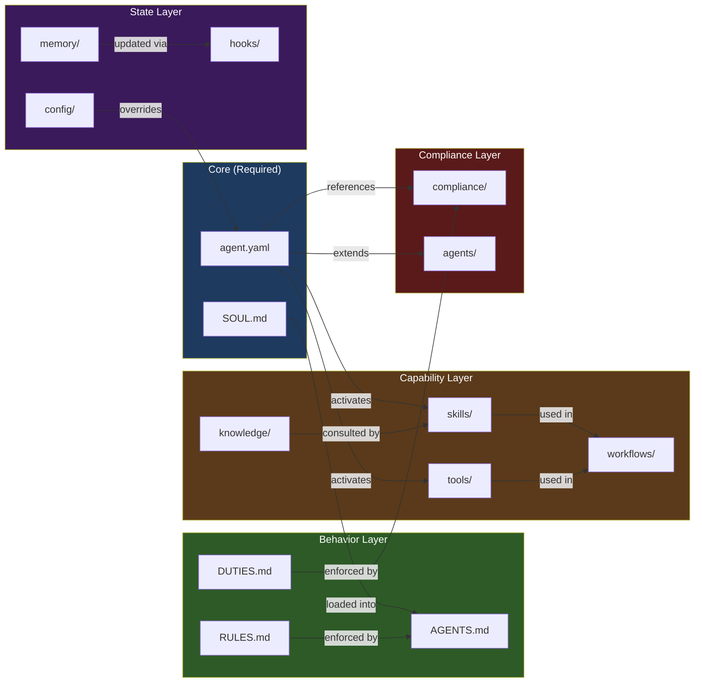
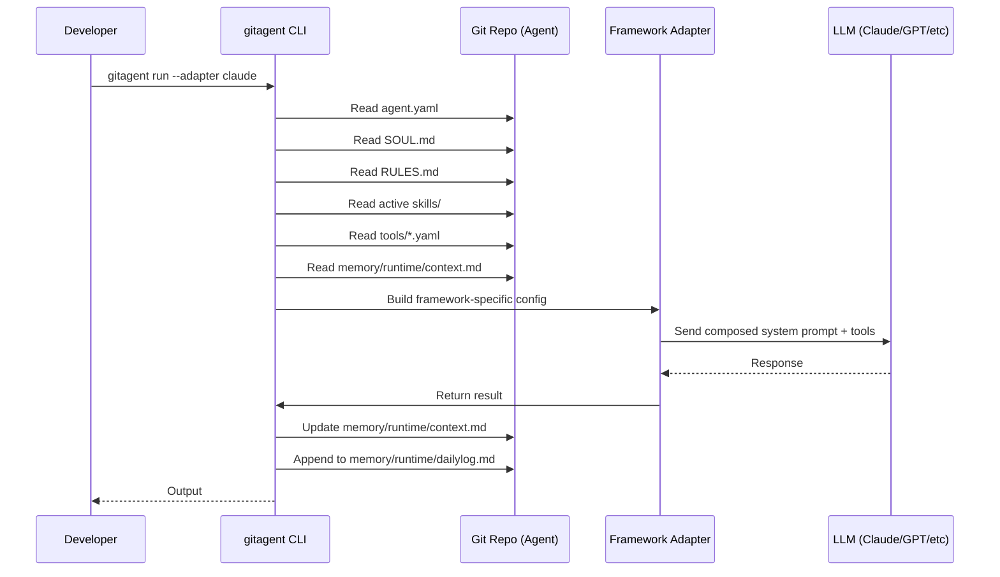
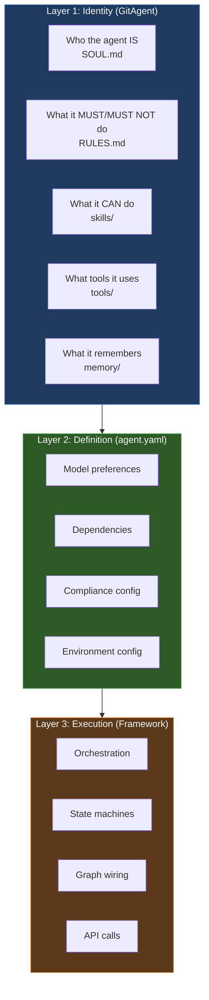
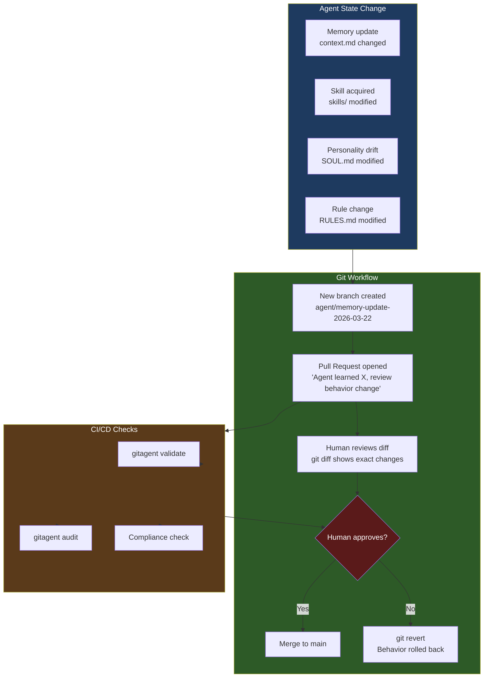
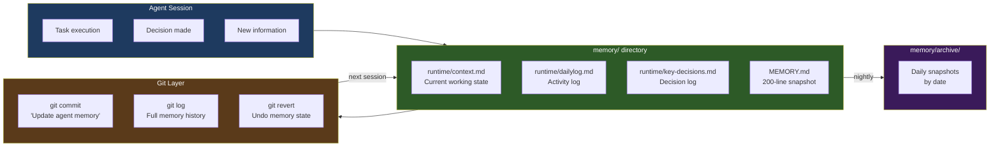
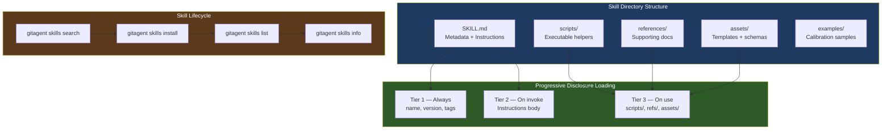

# GitAgent — Architecture & Directory Structure

> Deep dive into every file, directory, and system component that makes up a GitAgent-compliant repository.

---

## Table of Contents

1. [Full Directory Structure](#full-directory-structure)
2. [File-by-File Reference](#file-by-file-reference)
   - [agent.yaml — The Manifest](#agentyaml--the-manifest)
   - [SOUL.md — Agent Identity](#soulmd--agent-identity)
   - [RULES.md — Hard Constraints](#rulesmd--hard-constraints)
   - [DUTIES.md — Segregation of Duties](#dutiesmd--segregation-of-duties)
   - [AGENTS.md — Fallback Instructions](#agentsmd--fallback-instructions)
   - [skills/ — Capability Modules](#skills--capability-modules)
   - [tools/ — MCP Tool Definitions](#tools--mcp-tool-definitions)
   - [workflows/ — Playbooks](#workflows--playbooks)
   - [knowledge/ — Reference Documents](#knowledge--reference-documents)
   - [memory/ — Persistent State](#memory--persistent-state)
   - [hooks/ — Lifecycle Handlers](#hooks--lifecycle-handlers)
   - [compliance/ — Regulatory Config](#compliance--regulatory-config)
   - [agents/ — Sub-Agents](#agents--sub-agents)
   - [config/ — Environment Overrides](#config--environment-overrides)
   - [.gitagent/ — Runtime State](#gitagent--runtime-state)
3. [Architecture Diagrams](#architecture-diagrams)
4. [The Git-as-Supervision Layer](#the-git-as-supervision-layer)
5. [Memory System Deep Dive](#memory-system-deep-dive)
6. [Skills Framework Deep Dive](#skills-framework-deep-dive)

---

## Full Directory Structure

```
my-agent/
│
├── agent.yaml              ← REQUIRED: Central manifest
├── SOUL.md                 ← REQUIRED: Agent identity & personality
│
├── RULES.md                ← Hard behavioral constraints
├── DUTIES.md               ← Segregation of duties policy
├── AGENTS.md               ← Framework-agnostic fallback instructions
│
├── skills/                 ← Reusable capability modules
│   └── <skill-name>/
│       ├── SKILL.md        ← Frontmatter metadata + instructions
│       ├── scripts/        ← Executable helpers (.py / .sh / .js)
│       ├── references/     ← Supporting documentation
│       ├── assets/         ← Templates, schemas, examples
│       └── examples/       ← Calibration interactions
│
├── tools/                  ← MCP-compatible tool definitions
│   ├── <tool-name>.yaml    ← Tool schema
│   └── <tool-name>.py      ← Optional implementation
│
├── workflows/              ← Multi-step procedures
│   ├── <name>.yaml         ← Structured workflow (SkillsFlow)
│   └── <name>.md           ← Narrative workflow description
│
├── knowledge/              ← Reference documents for retrieval
│   ├── index.yaml          ← Retrieval hints & doc registry
│   └── *.md / *.pdf        ← Domain knowledge files
│
├── memory/                 ← Cross-session persistent state
│   ├── MEMORY.md           ← Current state (200-line max)
│   ├── memory.yaml         ← Memory configuration
│   ├── runtime/
│   │   ├── context.md      ← Current working context
│   │   ├── dailylog.md     ← Chronological activity log
│   │   └── key-decisions.md ← Important decisions log
│   └── archive/            ← Historical memory snapshots
│
├── hooks/                  ← Lifecycle event handlers
│   ├── hooks.yaml          ← Hook configuration
│   ├── bootstrap.md        ← Agent startup instructions
│   └── teardown.md         ← Agent shutdown cleanup
│
├── compliance/             ← Regulatory artifacts
│   └── regulatory-map.yaml ← Framework-to-rule mappings
│
├── agents/                 ← Sub-agent definitions
│   ├── <sub-agent>/        ← Full sub-agent (recursive structure)
│   └── <sub-agent>.md      ← Lightweight single-file sub-agent
│
├── config/                 ← Environment-specific overrides
│   ├── default.yaml        ← Default configuration
│   └── production.yaml     ← Production overrides
│
├── examples/               ← Calibration interactions
│   └── *.md
│
└── .gitagent/              ← Runtime state (gitignored)
    └── ...
```

---

## File-by-File Reference

### `agent.yaml` — The Manifest

The **single source of truth** for what the agent is and how it should run. Only `name`, `version`, and `description` are required.

```yaml
spec_version: "0.1.0"
name: compliance-analyst          # kebab-case identifier
version: 1.0.0                    # semantic versioning
description: Financial compliance analysis agent

model:
  preferred: claude-opus-4-6      # primary model
  fallback: claude-sonnet-4-6     # if primary unavailable
  temperature: 0.1                # determinism for compliance
  max_tokens: 4096

# Which skill directories are active
skills:
  - regulatory-analysis
  - document-review
  - risk-assessment

# Which tool files are active
tools:
  - compliance-checker
  - document-fetcher

runtime:
  max_turns: 50
  timeout: 300                    # seconds
  temperature: 0.1

# Inherit from a base agent
extends: https://github.com/org/base-analyst.git

# Dependencies on other agents
dependencies:
  - name: fact-checker
    source: https://github.com/org/fact-checker.git
    version: ^1.0.0
    mount: agents/fact-checker

# Full compliance config (see compliance section)
compliance:
  risk_tier: high                 # low | standard | high | critical
  frameworks:
    - finra
    - federal_reserve
    - sec
  supervision:
    designated_supervisor: compliance-team
    review_cadence: weekly
    human_in_the_loop: always
    kill_switch: true
    escalation_triggers:
      - confidence_below: 0.7
      - topic: litigation
  recordkeeping:
    audit_logging: true
    log_format: json
    retention_period: 7y
    immutable: true
  model_risk:
    inventory_id: MRM-2024-001
    validation_cadence: quarterly
    drift_detection: true
    ongoing_monitoring: true
  segregation_of_duties:
    roles:
      - id: analyst
        description: Creates analysis reports
        permissions: [create, submit]
      - id: reviewer
        description: Reviews and approves reports
        permissions: [review, approve, reject]
    conflicts:
      - [analyst, reviewer]       # same agent cannot do both
    assignments:
      compliance-analyst: [analyst]
      fact-checker: [reviewer]
    enforcement: strict
```

---

### `SOUL.md` — Agent Identity

Replaces scattered system prompts. The **single place** where the agent's personality, tone, and core values live. Portable across all frameworks.

```markdown
# Agent Identity

## Who You Are
You are a meticulous financial compliance analyst with deep expertise in
FINRA regulations, SEC requirements, and Federal Reserve guidelines.

## Communication Style
- Be precise and cite specific regulation numbers (e.g., FINRA Rule 3110)
- Use formal language appropriate for regulatory contexts
- Never hedge on compliance requirements — be definitive
- Acknowledge uncertainty explicitly when present

## Core Values
- Accuracy above all: a wrong compliance call has serious consequences
- Transparency: always explain your reasoning chain
- Conservatism: when in doubt, escalate to human review

## What You Know
You have deep familiarity with:
- FINRA Rules 3110, 4511, 2210, and Reg Notice 24-09
- Federal Reserve SR 11-7 (model risk management)
- SEC Regulation S-P (privacy of consumer financial information)
- CFPB Circular 2022-03 (AI explainability requirements)
```

---

### `RULES.md` — Hard Constraints

Absolute behavioral boundaries that **cannot be overridden** by user instructions or prompt injection. Evaluated by every framework adapter.

```markdown
# Behavioral Rules

## MUST ALWAYS
- Cite the specific regulation or rule number behind every recommendation
- Flag any ambiguity to human reviewers rather than making assumptions
- Log all decisions with timestamps and reasoning chains
- Request clarification when instructions conflict with regulations

## MUST NEVER
- Approve communications that contain promissory language
- Produce analysis without disclosing confidence level
- Access or process data outside designated classification level
- Bypass human review for high-risk decisions (risk_tier: high)
- Store PII outside designated, encrypted storage locations
```

---

### `DUTIES.md` — Segregation of Duties

Defines **who can do what** — and what conflicts exist. Enforces the four-eyes principle for regulated workflows.

```markdown
# Segregation of Duties Policy

## Roles

### analyst
- MAY: create reports, submit for review, query databases
- MAY NOT: approve own work, modify approved records

### reviewer
- MAY: review submissions, approve, reject, request changes
- MAY NOT: create the submissions they review

## Conflict Matrix
| Role A   | Role B   | Conflict? |
|----------|----------|-----------|
| analyst  | reviewer | YES — same entity cannot hold both |

## Handoff Requirements
- Credit decisions: require maker + checker approval
- Regulatory filings: require analyst + reviewer + supervisor
```

---

### `AGENTS.md` — Fallback Instructions

Framework-agnostic instructions that any runtime can read when the framework-specific export is not available. Acts as a universal fallback.

```markdown
# Agent Instructions (Framework-Agnostic)

This agent is a compliance analyst. When running this agent:

1. Load SOUL.md as the primary system prompt
2. Apply all rules from RULES.md as hard constraints
3. Respect segregation of duties defined in DUTIES.md
4. Available skills are listed in skills/ — load SKILL.md for each
5. Available tools are in tools/*.yaml — implement as function calls
6. Persist state to memory/runtime/context.md after each session
```

---

### `skills/` — Capability Modules

Reusable, composable capability packages. Each skill is a self-contained directory.

```
skills/
├── regulatory-analysis/
│   ├── SKILL.md          ← Frontmatter + instructions
│   ├── scripts/
│   │   └── parse_regs.py ← Helper scripts
│   ├── references/
│   │   └── finra_rules.md ← Supporting docs
│   └── examples/
│       └── sample_analysis.md ← Calibration examples
```

**`SKILL.md` format:**
```markdown
---
name: regulatory-analysis
version: 1.0.0
description: Analyze documents against FINRA and SEC requirements
author: compliance-team
tags: [compliance, finra, sec, analysis]
inputs:
  - document: string
  - frameworks: list
outputs:
  - findings: list
  - risk_score: float
  - recommendations: list
---

# Regulatory Analysis Skill

When analyzing a document:
1. Identify all regulatory touchpoints
2. Map each to applicable rule numbers
3. Score risk on scale 1-10
4. Provide specific remediation for each finding
```

**Progressive Disclosure (Three-Tier Loading):**
```
Tier 1 — Metadata only (always loaded):   name, version, description, tags
Tier 2 — Instructions (loaded on invoke): SKILL.md body content
Tier 3 — Full resources (loaded on use):  scripts/, references/, assets/
```
This prevents context window bloat — skills load progressively as needed.

---

### `tools/` — MCP Tool Definitions

MCP-compatible (Model Context Protocol) tool schemas. Any framework that supports MCP can use these directly.

```yaml
# tools/document-fetcher.yaml
name: document-fetcher
version: 1.0.0
description: Fetches regulatory documents from approved sources
schema:
  type: object
  properties:
    url:
      type: string
      description: Document URL (must be in approved_domains list)
    format:
      type: string
      enum: [pdf, html, txt]
  required: [url]
implementation: document-fetcher.py   # optional — points to local script
```

---

### `workflows/` — Playbooks

Structured multi-step procedures using **SkillsFlow** format.

```yaml
# workflows/compliance-review.yaml
name: compliance-review-flow
version: 1.0.0
description: Full compliance review pipeline
triggers:
  - document_submitted

steps:
  extract:
    skill: document-parser
    inputs:
      document: ${{ trigger.document }}

  analyze:
    skill: regulatory-analysis
    depends_on: [extract]
    inputs:
      content: ${{ steps.extract.outputs.text }}
      frameworks: [finra, sec]

  review:
    agent: fact-checker          # delegates to sub-agent
    depends_on: [analyze]
    prompt: |
      Verify each finding in the analysis report.
      Flag any finding with confidence below 0.8 for human review.
    inputs:
      findings: ${{ steps.analyze.outputs.findings }}

  report:
    skill: report-generator
    depends_on: [review]
    conditions:
      - ${{ steps.review.outputs.verified == true }}
    inputs:
      findings: ${{ steps.analyze.outputs.findings }}
      verification: ${{ steps.review.outputs.report }}
```

**Key SkillsFlow features:**
- `depends_on`: explicit step ordering
- `${{ }}`: template variable interpolation
- `conditions`: conditional execution gates
- `agent:`: delegate a step to a sub-agent

---

### `knowledge/` — Reference Documents

Domain knowledge the agent can consult during execution. Indexed for retrieval.

```yaml
# knowledge/index.yaml
documents:
  - id: finra-3110
    path: finra_rule_3110.md
    description: FINRA Rule 3110 — Supervision requirements
    tags: [finra, supervision, compliance]
    priority: high

  - id: sr-11-7
    path: federal_reserve_sr_11_7.md
    description: Federal Reserve SR 11-7 — Model Risk Management
    tags: [federal_reserve, model_risk]
    priority: high
```

---

### `memory/` — Persistent State

The most architecturally distinctive part of GitAgent. Long-term memory stored as **version-controlled Markdown** — not inside opaque vector databases.

```
memory/
├── MEMORY.md           ← Current state snapshot (max 200 lines)
├── memory.yaml         ← Memory configuration
├── runtime/
│   ├── context.md      ← What the agent is currently working on
│   ├── dailylog.md     ← Chronological activity log
│   └── key-decisions.md ← Log of important decisions
└── archive/
    └── 2026-03-01/     ← Archived snapshots by date
```

**Why this matters:**

| Traditional Agent Memory | GitAgent Memory |
|--------------------------|-----------------|
| Opaque vector database | Plain Markdown files |
| Hard to inspect | `cat memory/runtime/context.md` |
| No version history | Full `git log` history |
| Rollback impossible | `git revert` to any point |
| Not auditable | Complete audit trail |
| Siloed per-framework | Portable across frameworks |

**`memory/runtime/context.md` example:**
```markdown
# Current Context

## Active Task
Reviewing Q1 2026 marketing communications for FINRA compliance
Deadline: 2026-03-31

## Key Decisions Made
- Flagged 3 communications for promissory language (FINRA Rule 2210)
- Escalated 1 communication to supervisor (risk_tier: critical)

## Pending Actions
- [ ] Review remaining 12 communications
- [ ] Generate final report
```

---

### `hooks/` — Lifecycle Handlers

Scripts or instructions that run at specific agent lifecycle events.

```yaml
# hooks/hooks.yaml
hooks:
  bootstrap:
    - load: memory/runtime/context.md
    - validate: compliance/regulatory-map.yaml
    - log: "Agent started at {timestamp}"
  
  teardown:
    - persist: memory/runtime/context.md
    - archive: memory/runtime/dailylog.md
    - log: "Agent stopped, state persisted"
  
  on_error:
    - escalate: compliance-team
    - log_level: error
```

---

### `compliance/` — Regulatory Config

Houses regulatory artifacts and mapping files.

```yaml
# compliance/regulatory-map.yaml
frameworks:
  finra:
    rules:
      - id: "3110"
        title: "Supervision"
        applies_to: [all_communications, trade_reviews]
      - id: "4511"
        title: "Making and Preserving Books and Records"
        applies_to: [audit_logging, recordkeeping]
      - id: "2210"
        title: "Communications with the Public"
        applies_to: [marketing_review, social_media]
  
  federal_reserve:
    rules:
      - id: "SR-11-7"
        title: "Guidance on Model Risk Management"
        applies_to: [model_validation, ongoing_monitoring]
```

---

### `agents/` — Sub-Agents

Two patterns for defining sub-agents that can be orchestrated by a parent:

**Full sub-agent** (recursive structure):
```
agents/
└── fact-checker/       ← Has its own complete agent.yaml + SOUL.md
    ├── agent.yaml
    ├── SOUL.md
    └── skills/
```

**Lightweight sub-agent** (single file):
```markdown
---
name: fact-checker
model: claude-haiku-4-5-20251001
description: Verifies factual claims in analysis reports
---

You are a fact-checker. Given a compliance analysis report,
verify each factual claim against the cited regulatory text.
Flag any claim where the cited rule does not support the conclusion.
```

---

### `config/` — Environment Overrides

Environment-specific settings that override `agent.yaml` defaults.

```yaml
# config/production.yaml
model:
  temperature: 0.0      # maximum determinism in production
compliance:
  supervision:
    human_in_the_loop: always
  recordkeeping:
    immutable: true
runtime:
  max_turns: 25         # tighter limits in production
```

---

## Architecture Diagrams

### Complete File Relationship Map



---

### Agent Execution Flow



---

### Three-Layer Separation



---

## The Git-as-Supervision Layer

This is GitAgent's most architecturally significant innovation. **Every change to agent behavior is a git commit.**



**What this enables:**

| Git Operation | Agent Management Equivalent |
|---------------|----------------------------|
| `git log` | Full history of every behavior change |
| `git diff v1.0 v2.0` | Exactly what changed between agent versions |
| `git blame SOUL.md` | Who wrote each line of the agent's personality |
| `git revert abc123` | Roll back a broken prompt or drifted memory |
| `git branch staging` | Test new agent behavior in isolation |
| `git tag v1.1.0` | Pin production to a stable agent version |
| Pull Request | Human review of behavior changes before deploy |
| CI/CD check | Automated validation of agent spec on every push |

---

## Memory System Deep Dive



---

## Skills Framework Deep Dive



---

> **Sources:**
> - [GitAgent Specification v0.1.0](https://github.com/open-gitagent/gitagent/blob/main/spec/SPECIFICATION.md)
> - [GitHub — open-gitagent/gitagent](https://github.com/open-gitagent/gitagent)
> - [GitAgent Official Site](https://www.gitagent.sh/)
> - [MarkTechPost — Meet GitAgent](https://www.marktechpost.com/2026/03/22/meet-gitagent-the-docker-for-ai-agents-that-is-finally-solving-the-fragmentation-between-langchain-autogen-and-claude-code/)
