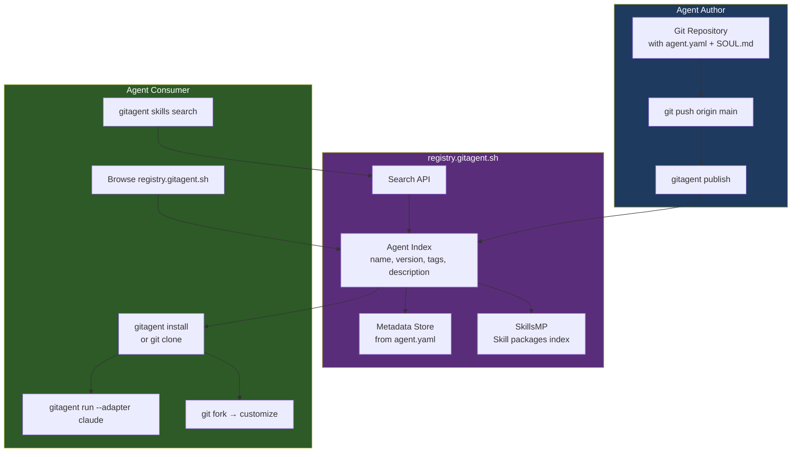
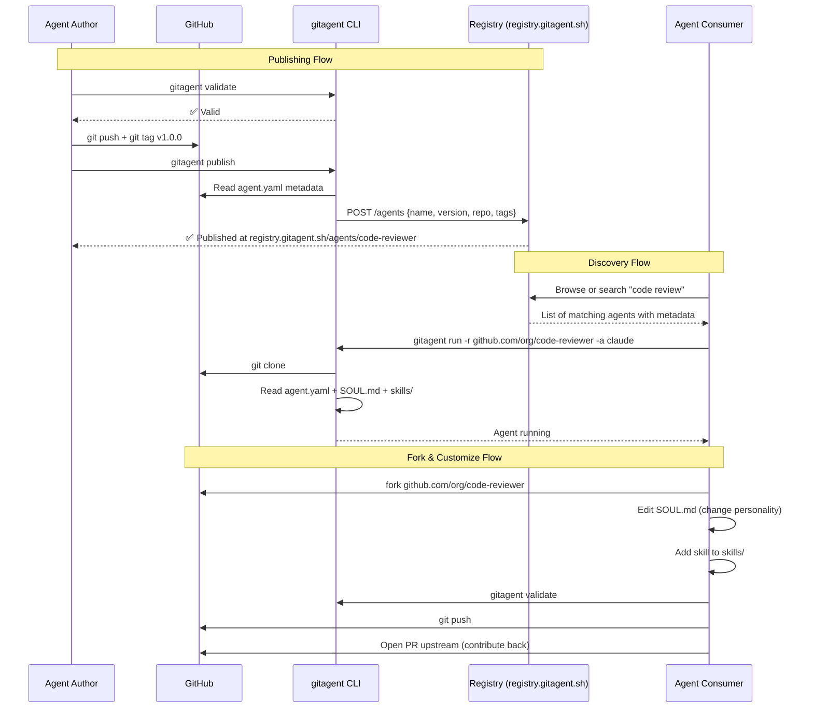
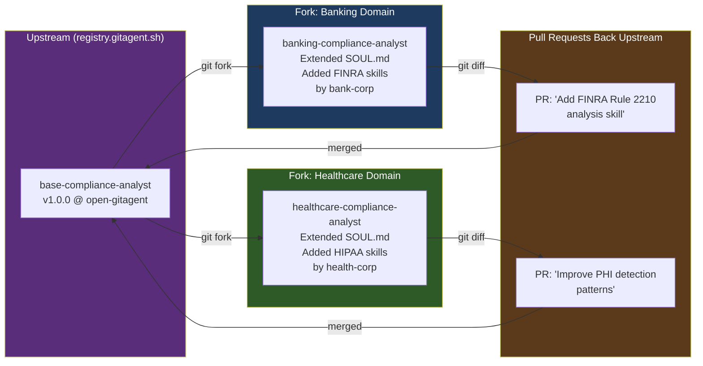
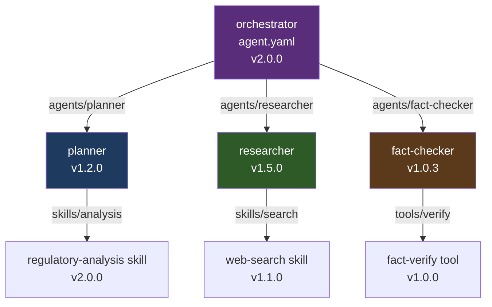

# GitAgent Registry — Discover, Share & Install Agents

> **registry.gitagent.sh** — The public registry for git-native AI agents.
> Browse, clone, fork, and publish community agents.

---

## Table of Contents

1. [What is the Registry?](#what-is-the-registry)
2. [Registry vs npm vs Docker Hub](#registry-vs-npm-vs-docker-hub)
3. [How the Registry Works](#how-the-registry-works)
4. [Discovering Agents](#discovering-agents)
5. [Installing an Agent](#installing-an-agent)
6. [Publishing Your Agent](#publishing-your-agent)
7. [The SkillsMP Marketplace](#the-skillsmp-marketplace)
8. [Registry Workflow Diagram](#registry-workflow-diagram)
9. [Agent Forking Pattern](#agent-forking-pattern)
10. [Dependency Resolution](#dependency-resolution)
11. [Versioning and Pinning](#versioning-and-pinning)

---

## What is the Registry?

The GitAgent Registry at **https://registry.gitagent.sh** is the public hub for discovering and sharing GitAgent-compliant repositories. It is the equivalent of:

- Docker Hub for container images
- npm for JavaScript packages
- PyPI for Python packages

...except every "package" is a **complete, runnable AI agent** defined as a git repository.

Key characteristics:
- **Git-native:** Every agent in the registry is a real git repository
- **Zero lock-in:** Clone the repo and run it yourself — no platform dependency
- **Fork-friendly:** Fork any public agent, customize `SOUL.md`, PR improvements back upstream
- **Version-pinned:** `agent.yaml` uses semantic versioning — pin to `^1.0.0`
- **Skill marketplace:** The **SkillsMP** sub-registry indexes reusable skill packages separately

---

## Registry vs npm vs Docker Hub

| Aspect | npm Registry | Docker Hub | GitAgent Registry |
|--------|-------------|------------|-------------------|
| Unit of packaging | JavaScript module | Container image | AI agent (git repo) |
| Primary artifact | `package.json` | `Dockerfile` | `agent.yaml` + `SOUL.md` |
| Version pinning | `^1.0.0` | `image:tag` | `^1.0.0` in agent.yaml |
| Fork & customize | Clone + modify | Fork Dockerfile | Fork + edit `SOUL.md` |
| Run command | `npx <pkg>` | `docker run ` | `gitagent run -r <repo>` |
| Publish | `npm publish` | `docker push` | `gitagent publish` |
| Open standard | ✅ | ✅ | ✅ |
| Human-readable | Partial | ❌ | ✅ (Markdown) |

---

## How the Registry Works

The registry is backed by GitHub repositories. When you publish an agent:

1. Your agent repository is indexed by the registry
2. `agent.yaml` metadata (name, version, description, tags) is used for search
3. The repo itself stays on GitHub — the registry is a **discovery layer**, not storage
4. Installs are just `git clone` under the hood



---

## Discovering Agents

### Via the Web UI

Browse https://registry.gitagent.sh to:
- Search by name, description, tags, framework
- Filter by compliance tier (low / standard / high / critical)
- View `agent.yaml` manifest inline
- See GitHub repo stats (stars, forks, last updated)
- One-click clone or run commands

### Via the CLI

```bash
# Search for agents by keyword
gitagent skills search "code review"
gitagent skills search "compliance finra"
gitagent skills search "research"

# Browse a specific agent
gitagent info --repo https://github.com/org/agent-name

# List installed agents/skills
gitagent skills list
```

### Registry Metadata Tags

Agents can be tagged with:

| Tag Category | Examples |
|-------------|---------|
| Domain | `finance`, `legal`, `engineering`, `marketing`, `research` |
| Compliance | `finra`, `sec`, `gdpr`, `hipaa`, `eu-ai-act` |
| Framework | `claude-code`, `openai`, `crewai`, `langchain` |
| Type | `analyst`, `reviewer`, `researcher`, `generator`, `classifier` |
| Risk tier | `low`, `standard`, `high`, `critical` |

---

## Installing an Agent

### Method 1: Direct `gitagent install`

```bash
# Install from registry (resolves git dependencies)
gitagent install

# Run a remote agent directly without cloning
npx @open-gitagent/gitagent@latest run \
  -r https://github.com/org/code-reviewer \
  -a claude
```

### Method 2: Git Clone (Manual)

```bash
# Clone the agent repo
git clone https://github.com/org/agent-name
cd agent-name

# Validate it conforms to spec
gitagent validate

# Export to your target framework
gitagent export --format claude-code
gitagent export --format openai
```

### Method 3: As a Dependency in `agent.yaml`

```yaml
# In your own agent.yaml
dependencies:
  - name: fact-checker
    source: https://github.com/open-gitagent/fact-checker.git
    version: ^1.2.0
    mount: agents/fact-checker

  - name: document-parser
    source: https://github.com/org/document-parser.git
    version: ^2.0.0
    mount: skills/document-parser
```

Then resolve all dependencies:

```bash
gitagent install
# Clones all deps to their mount paths
# Validates version compatibility
# Builds dependency graph
```

---

## Publishing Your Agent

### Step 1: Prepare Your Agent

```bash
# Make sure you have required files
ls
# agent.yaml ← Required
# SOUL.md    ← Required
# RULES.md   ← Recommended
# README.md  ← Recommended for registry visibility

# Validate the spec
gitagent validate

# Run compliance check if applicable
gitagent validate --compliance

# Generate audit report
gitagent audit
```

### Step 2: Tag a Release

```bash
# Commit final changes
git add .
git commit -m "chore: release v1.0.0"

# Tag the release (registry uses semver tags)
git tag v1.0.0
git push origin main --tags
```

### Step 3: Publish to Registry

```bash
gitagent publish
# This:
# 1. Reads agent.yaml metadata
# 2. Submits to registry index
# 3. Links to your GitHub repo
# 4. Makes it discoverable at registry.gitagent.sh
```

### What Gets Published

The registry stores the **metadata** from `agent.yaml`, not your code. Your repository stays on GitHub. The registry entry includes:

```
name:        code-reviewer
version:     1.0.0
description: Meticulous code reviewer for security and performance
author:      your-github-handle
repo:        https://github.com/you/code-reviewer
tags:        [engineering, code-review, security]
risk_tier:   medium
frameworks:  [claude-code, openai, crewai]
published:   2026-03-22
```

### Publishing Guidelines

- `name` must be globally unique in the registry
- `version` must follow semantic versioning (X.Y.Z)
- `SOUL.md` and `agent.yaml` must be present and valid
- Include a `README.md` for discoverability
- Tag the release in git before publishing
- Do not include secrets in any tracked file (use `.env` + `.gitignore`)

---

## The SkillsMP Marketplace

A sub-registry specifically for **skill packages** — reusable capability modules that can be installed into any agent.

```bash
# Search skills marketplace
gitagent skills search "document-parser"
gitagent skills search "sql-analysis"
gitagent skills search "web-scraper"

# Install a skill into your agent
gitagent skills install document-parser
# → downloads to skills/document-parser/

# View skill details
gitagent skills info document-parser

# List installed skills
gitagent skills list
```

### Skill Package Structure in Registry

Each skill in SkillsMP is indexed by:

```yaml
# From SKILL.md frontmatter
name: document-parser
version: 2.1.0
description: Parse PDF, DOCX, and HTML documents into structured text
author: open-gitagent
tags: [parsing, documents, pdf, extraction]
inputs:
  - file_path: string
  - format: enum[pdf, docx, html]
outputs:
  - text: string
  - metadata: object
  - page_count: integer
```

---

## Registry Workflow Diagram



---

## Agent Forking Pattern

The registry is designed for **collaborative improvement** via git forks.



### Fork Workflow

```bash
# 1. Fork on GitHub
gh repo fork open-gitagent/compliance-analyst --clone

# 2. Customize identity
cd compliance-analyst
vim SOUL.md          # Adjust personality for your domain
vim RULES.md         # Add domain-specific constraints

# 3. Add domain skills
gitagent skills install hipaa-checker
gitagent skills install phi-detector

# 4. Validate
gitagent validate --compliance

# 5. Run your fork
gitagent export --format claude-code

# 6. Contribute improvements back
gh pr create --title "Add HIPAA PHI detection skill"
```

---

## Dependency Resolution

`agent.yaml` supports git-based dependencies (like `go.mod` or `package.json` but for agents):

```yaml
dependencies:
  - name: fact-checker
    source: https://github.com/open-gitagent/fact-checker.git
    version: ^1.0.0          # semver range
    mount: agents/fact-checker

  - name: research-analyst
    source: https://github.com/org/research-analyst.git
    version: 2.1.0            # exact version pin
    mount: agents/researcher
```

```bash
# Resolve and install all dependencies
gitagent install

# What this does:
# 1. Reads all dependencies from agent.yaml
# 2. Clones each at the correct version (git tag)
# 3. Mounts them at the specified path
# 4. Validates compatibility with your spec_version
# 5. Builds a dependency lock file
```

**Dependency graph for a multi-agent system:**



---

## Versioning and Pinning

```bash
# Tag a release
git tag v1.1.0
git push --tags

# In agent.yaml, consumers pin via:
dependencies:
  - name: fact-checker
    version: ^1.0.0     # any 1.x.x
    version: ~1.1.0     # any 1.1.x
    version: 1.0.3      # exact pin
    version: main       # latest main (not recommended for prod)

# Branch-based environments
git checkout -b staging
# staging branch = staging environment for the agent

# Production pinned to a tag
git checkout v1.1.0
gitagent run --adapter claude
```

---

> **Sources:**
> - [GitAgent Registry](https://registry.gitagent.sh/)
> - [GitHub — open-gitagent/gitagent](https://github.com/open-gitagent/gitagent)
> - [GitAgent Official Site](https://www.gitagent.sh/)
> - [Lyzr — Getting Started with GitAgent](https://www.lyzr.ai/blog/gitagent)
> - [Product Hunt — GitAgent by Lyzr](https://www.producthunt.com/products/gitagent-2)
