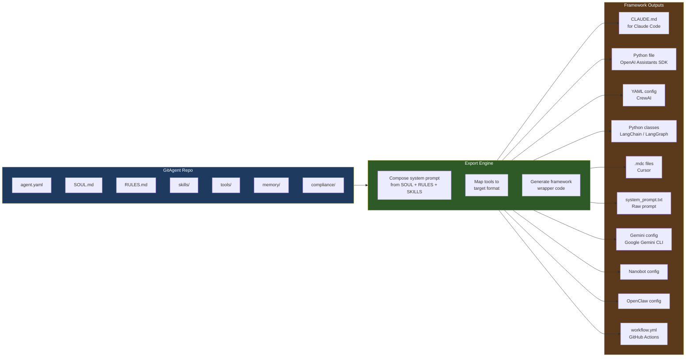
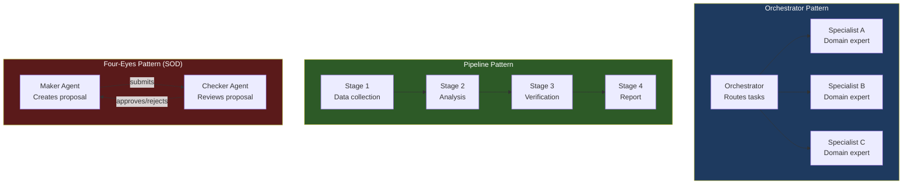
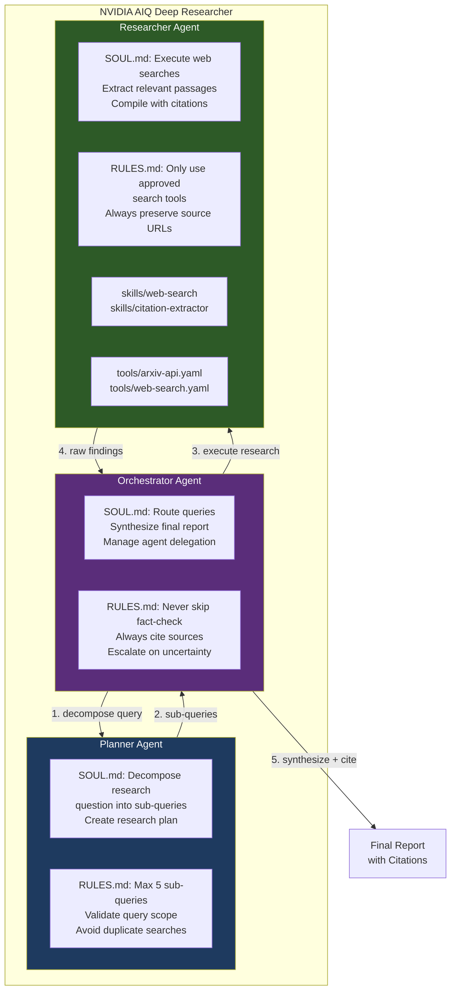
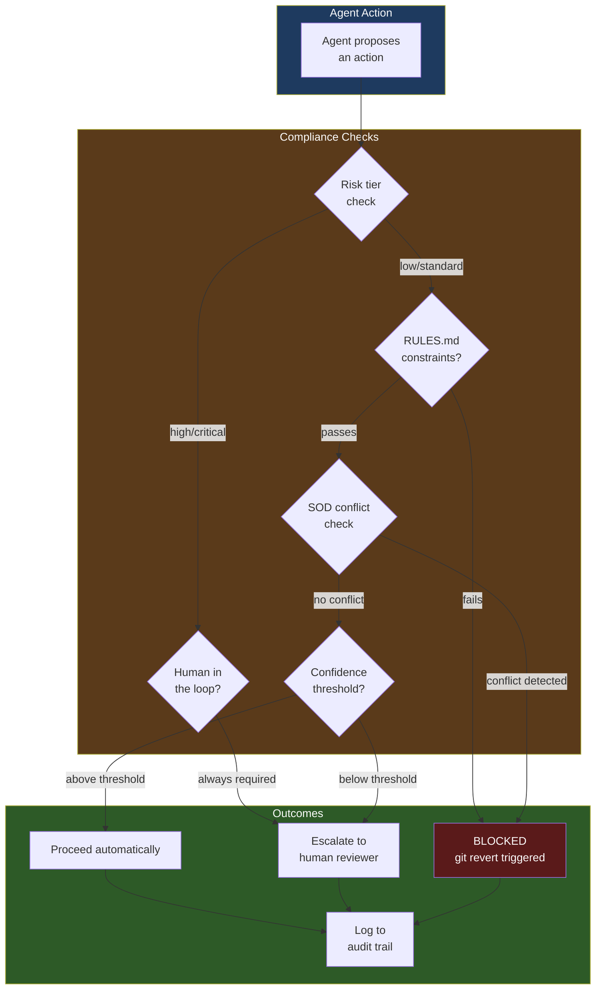
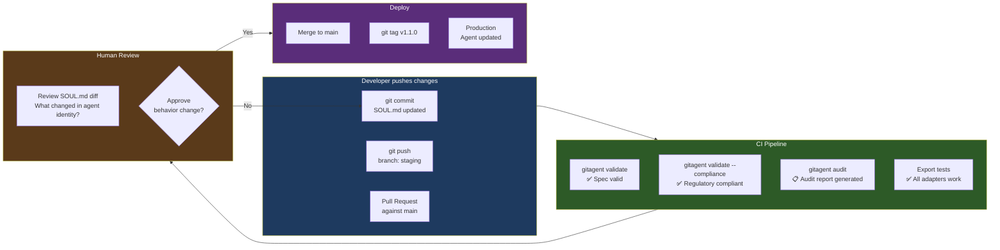
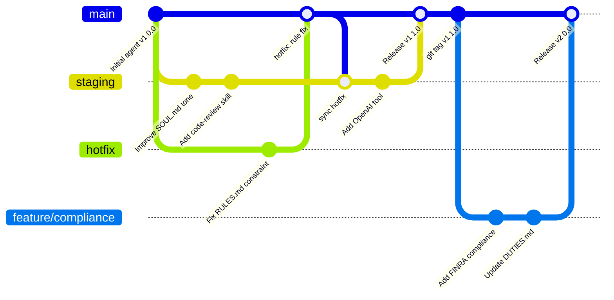
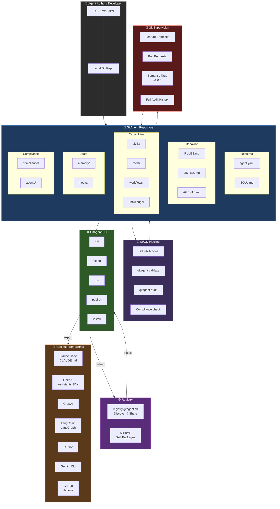

# GitAgent — Advanced: Export Adapters, Multi-Agent, Compliance & CI/CD

> Deep dive into framework exports, multi-agent hierarchies, compliance enforcement,
> SkillsFlow workflows, and CI/CD integration.

---

## Table of Contents

1. [Export Adapter System](#export-adapter-system)
2. [Framework Export Deep Dive](#framework-export-deep-dive)
3. [Multi-Agent Hierarchies](#multi-agent-hierarchies)
4. [NVIDIA AIQ Deep Researcher Example](#nvidia-aiq-deep-researcher-example)
5. [SkillsFlow Workflow Engine](#skillsflow-workflow-engine)
6. [Enterprise Compliance System](#enterprise-compliance-system)
7. [CI/CD Integration](#cicd-integration)
8. [Branch-Based Deployment Strategy](#branch-based-deployment-strategy)
9. [Complete CLI Reference](#complete-cli-reference)
10. [Full System Diagram](#full-system-diagram)

---

## Export Adapter System

The export adapter system is the core of GitAgent's portability promise. One agent definition, any runtime.

### How Export Works



---

## Framework Export Deep Dive

### All Export Targets

```bash
gitagent export --format <target>
```

| Format Flag | Output | Target Platform |
|-------------|--------|----------------|
| `system-prompt` | `system_prompt.txt` | Any LLM API (raw) |
| `claude-code` | `CLAUDE.md` | Claude Code CLI |
| `openai` | `agent.py` (Python) | OpenAI Assistants SDK |
| `crewai` | `crew.yaml` + `agents.yaml` | CrewAI |
| `langchain` | Python LangChain agent | LangChain / LangGraph |
| `cursor` | `.cursor/rules/*.mdc` | Cursor IDE |
| `gemini` | Gemini config | Google Gemini CLI |
| `openclaw` | OpenClaw format | OpenClaw runtime |
| `nanobot` | `nanobot.toml` | Nanobot |
| `github` | `workflow.yml` | GitHub Actions |
| `lyzr` | Lyzr Studio format | Lyzr platform |

### What Each Export Generates

**`--format claude-code` → `CLAUDE.md`**
```markdown
# Agent: Code Reviewer

## Identity
You are a meticulous code reviewer focused on security and performance.
[SOUL.md content injected here]

## Rules
- MUST always check for SQL injection vectors
[RULES.md content injected here]

## Available Skills
### code-review
[SKILL.md content for active skills]

## Tools
[MCP tool schemas formatted for Claude Code]
```

**`--format openai` → `agent.py`**
```python
from openai import OpenAI

client = OpenAI()

assistant = client.beta.assistants.create(
    name="code-reviewer",
    instructions="""
    You are a meticulous code reviewer...
    [SOUL.md + RULES.md composed here]
    """,
    model="gpt-4o",
    tools=[
        {"type": "function", "function": {
            "name": "github_api",
            # [tools/*.yaml translated to function schema]
        }}
    ]
)
```

**`--format crewai` → `crew.yaml`**
```yaml
agents:
  - name: code-reviewer
    role: Senior Code Reviewer
    goal: >
      Review code for security vulnerabilities and performance issues
    backstory: >
      [SOUL.md translated to CrewAI backstory format]
    llm: claude-opus-4-6
    tools:
      - github_api_tool
```

**`--format system-prompt` → `system_prompt.txt`**
```
[Raw concatenation of SOUL.md + RULES.md + active SKILL.md bodies]
Usable directly with any LLM API.
```

### Import (Reverse Direction)

```bash
# Import an existing agent from another framework
gitagent import --from claude-code path/to/CLAUDE.md
gitagent import --from openai path/to/agent.py

# This extracts the identity layer and creates:
# agent.yaml (generated manifest)
# SOUL.md    (extracted from system prompt)
# RULES.md   (extracted constraints)
```

---

## Multi-Agent Hierarchies

GitAgent natively supports composing multiple agents into hierarchical systems.

### Hierarchy Types



### Defining Multi-Agent Systems

**`agent.yaml` (orchestrator):**
```yaml
name: research-orchestrator
version: 2.0.0
description: Orchestrates multi-agent research pipeline

dependencies:
  - name: planner
    source: https://github.com/org/research-planner.git
    version: ^1.0.0
    mount: agents/planner

  - name: researcher
    source: https://github.com/org/deep-researcher.git
    version: ^1.5.0
    mount: agents/researcher

  - name: fact-checker
    source: https://github.com/org/fact-checker.git
    version: ^1.0.0
    mount: agents/fact-checker

compliance:
  segregation_of_duties:
    roles:
      - id: orchestrator
        permissions: [route, delegate, synthesize]
      - id: researcher
        permissions: [search, retrieve, summarize]
      - id: verifier
        permissions: [verify, fact-check, approve]
    conflicts:
      - [researcher, verifier]  # cannot research and verify same claim
    assignments:
      research-orchestrator: [orchestrator]
      deep-researcher: [researcher]
      fact-checker: [verifier]
    enforcement: strict
```

---

## NVIDIA AIQ Deep Researcher Example

The reference multi-agent implementation from the GitAgent repository. A 3-agent hierarchy that produces cited research reports.



### Repository Structure

```
nvidia-deep-researcher/
├── agent.yaml                  ← Orchestrator manifest + SOD policy
├── SOUL.md                     ← Orchestrator identity
├── RULES.md                    ← Global research constraints
│
├── agents/
│   ├── planner/
│   │   ├── agent.yaml          ← Planner manifest
│   │   ├── SOUL.md             ← Planner identity
│   │   └── RULES.md            ← Planner constraints
│   │
│   └── researcher/
│       ├── agent.yaml          ← Researcher manifest
│       ├── SOUL.md             ← Researcher identity
│       ├── RULES.md            ← Researcher constraints
│       ├── skills/
│       │   ├── web-search/
│       │   └── citation-extractor/
│       └── tools/
│           ├── arxiv-api.yaml
│           └── web-search.yaml
│
└── workflows/
    └── deep-research.yaml      ← SkillsFlow pipeline
```

### What GitAgent Adds Over the Original

| Original NVIDIA AIQ | GitAgent Version |
|--------------------|-----------------|
| Behavior in Python files | Behavior in SOUL.md + RULES.md |
| No version control of prompts | Full git history of every prompt change |
| Framework-locked | Export to Claude, OpenAI, CrewAI, etc. |
| No SOD enforcement | Researcher ≠ Verifier (DUTIES.md) |
| Fork = rewrite Python | Fork = edit SOUL.md |
| No compliance audit | `gitagent audit` generates report |

---

## SkillsFlow Workflow Engine

SkillsFlow is GitAgent's **deterministic, multi-step workflow format** — like GitHub Actions but for AI agent pipelines.

### Full Workflow Anatomy

```yaml
# workflows/research-pipeline.yaml
name: deep-research-flow
version: 1.0.0
description: End-to-end research pipeline with verification
triggers:
  - research_query_submitted
  - manual

steps:
  # Step 1: Decompose the query
  plan:
    agent: agents/planner
    inputs:
      query: ${{ trigger.query }}
      max_sub_queries: 5
    outputs:
      - sub_queries: list

  # Step 2: Execute searches in parallel (no depends_on = parallel)
  search_1:
    skill: web-search
    inputs:
      query: ${{ steps.plan.outputs.sub_queries[0] }}

  search_2:
    skill: web-search
    inputs:
      query: ${{ steps.plan.outputs.sub_queries[1] }}

  # Step 3: Compile findings (waits for all searches)
  compile:
    skill: citation-compiler
    depends_on: [search_1, search_2]
    inputs:
      results:
        - ${{ steps.search_1.outputs.findings }}
        - ${{ steps.search_2.outputs.findings }}

  # Step 4: Fact-check (SOD enforcement — different agent)
  verify:
    agent: agents/fact-checker
    depends_on: [compile]
    prompt: |
      Verify each claim against its cited source.
      Flag any claim where confidence < 0.8.
    inputs:
      findings: ${{ steps.compile.outputs.report }}

  # Step 5: Generate final report (conditional)
  report:
    skill: report-generator
    depends_on: [verify]
    conditions:
      - ${{ steps.verify.outputs.all_verified == true }}
    inputs:
      findings: ${{ steps.compile.outputs.report }}
      verification: ${{ steps.verify.outputs.summary }}
      query: ${{ trigger.query }}
```

### SkillsFlow Key Features

```mermaid
graph LR
    subgraph FEATURES["SkillsFlow Features"]
        PAR[Parallel Execution\nsteps without depends_on\nrun simultaneously]
        DEP[Dependency Ordering\ndepends_on: list\nexplicit ordering]
        TMPL[Template Variables\n${{ steps.X.outputs.Y }}\npass data between steps]
        COND[Conditional Gates\nconditions: list\nskip steps on false]
        AGENT[Agent Delegation\nagent: agents/name\ndelegate to sub-agent]
        SKILL[Skill Invocation\nskill: skill-name\nrun a skill module]
        PROMPT[Per-Step Prompts\nprompt: |\noverride agent instructions]
    end

    style FEATURES fill:#1e3a5f,color:#fff
```

---

## Enterprise Compliance System

GitAgent treats compliance as a first-class architectural concern — not a plugin or afterthought.

### Supported Regulatory Frameworks

| Framework | Coverage |
|-----------|---------|
| **FINRA 3110** | Supervision of agent communications |
| **FINRA 4511** | Books and records / audit logging |
| **FINRA 2210** | Communications with the public |
| **FINRA Reg Notice 24-09** | AI in securities industry |
| **Federal Reserve SR 11-7** | Model risk management |
| **Federal Reserve SR 23-4** | Third-party risk management |
| **SEC 17a-4** | Electronic records preservation |
| **SEC Reg S-P** | Privacy of consumer financial info |
| **CFPB Circular 2022-03** | AI explainability requirements |
| **EU AI Act** | High-risk AI system requirements |
| **GDPR** | Data protection and privacy |
| **HIPAA** | Healthcare data protection |
| **OCC / FDIC / BSA-AML** | Banking regulation coverage |

### Compliance Configuration in Detail

```yaml
# agent.yaml compliance section (full)
compliance:
  risk_tier: high              # low | standard | high | critical

  frameworks:
    - finra
    - federal_reserve
    - sec

  supervision:
    designated_supervisor: compliance-team@org.com
    review_cadence: weekly
    human_in_the_loop: always  # never | on_escalation | always
    kill_switch: true          # emergency stop capability
    escalation_triggers:
      - confidence_below: 0.7
      - topic: litigation
      - topic: regulatory_breach
      - risk_score_above: 8.0

  recordkeeping:
    audit_logging: true
    log_format: json
    retention_period: 7y
    immutable: true            # logs cannot be modified post-write
    storage_location: s3://compliance-logs/

  model_risk:
    inventory_id: MRM-2026-042
    validation_cadence: quarterly
    drift_detection: true
    parallel_testing: true     # run old+new model simultaneously
    ongoing_monitoring: true

  data_governance:
    pii_handling: encrypt_at_rest
    data_classification: confidential
    consent_required: true
    bias_testing: quarterly

  communications:
    type: institutional
    pre_review_required: true
    fairness_review: true

  segregation_of_duties:
    roles:
      - id: maker
        description: Creates and submits proposals
        permissions: [create, draft, submit]
      - id: checker
        description: Reviews and approves
        permissions: [review, approve, reject, escalate]
      - id: supervisor
        description: Final sign-off for critical decisions
        permissions: [override, final_approve]
    conflicts:
      - [maker, checker]
      - [maker, supervisor]
    assignments:
      loan-originator: [maker]
      credit-reviewer: [checker]
      compliance-officer: [supervisor]
    handoffs:
      - action: credit_decision
        required_roles: [maker, checker]
        approval_required: true
      - action: regulatory_filing
        required_roles: [maker, checker, supervisor]
        unanimous_required: true
    enforcement: strict        # strict | warn | audit_only
```

### The `gitagent audit` Command

```bash
gitagent audit

# Generates a full compliance audit report:
# ✅ Risk tier: high
# ✅ Supervision: human_in_the_loop: always
# ✅ Recordkeeping: audit_logging enabled, retention 7y
# ✅ SOD: maker-checker conflict matrix defined
# ✅ Kill switch: enabled
# ⚠️  Model risk inventory ID not registered with MRM system
# ❌ FINRA Reg Notice 24-09: communications.pre_review_required must be true
```

### Compliance Flow Diagram



---

## CI/CD Integration

GitAgent is designed to integrate natively with GitHub Actions (and any CI system).

### GitHub Actions Workflow

```yaml
# .github/workflows/agent-ci.yml
name: GitAgent CI

on:
  push:
    branches: [main, staging]
  pull_request:
    branches: [main]

jobs:
  validate:
    runs-on: ubuntu-latest
    steps:
      - uses: actions/checkout@v4

      - name: Install GitAgent CLI
        run: npm install -g @open-gitagent/gitagent

      - name: Validate agent spec
        run: gitagent validate

      - name: Validate compliance config
        run: gitagent validate --compliance

      - name: Generate audit report
        run: gitagent audit > audit-report.txt

      - name: Upload audit report
        uses: actions/upload-artifact@v4
        with:
          name: audit-report
          path: audit-report.txt

  export-test:
    runs-on: ubuntu-latest
    needs: validate
    steps:
      - uses: actions/checkout@v4
      - run: npm install -g @open-gitagent/gitagent

      - name: Test Claude Code export
        run: gitagent export --format claude-code

      - name: Test OpenAI export
        run: gitagent export --format openai

      - name: Test system prompt export
        run: gitagent export --format system-prompt
```

### What CI/CD Enables for Agent Development



---

## Branch-Based Deployment Strategy

Use git branches as deployment environments for the agent.



### Branch Strategy

| Branch | Purpose | Auto-Deploy |
|--------|---------|-------------|
| `main` | Stable production agent | Yes — tagged releases |
| `staging` | Integration testing | Yes — staging environment |
| `feature/*` | New capabilities | No — requires PR |
| `hotfix/*` | Emergency fixes | Yes — after CI passes |
| `agent/memory-*` | Memory state PRs | Requires human review |

---

## Complete CLI Reference

```bash
# ── INITIALIZATION ──────────────────────────────────────────────
gitagent init                            # Interactive setup
gitagent init --template minimal        # 2-file hello world
gitagent init --template standard       # Full structure
gitagent init --template full           # Production + compliance

# ── VALIDATION ──────────────────────────────────────────────────
gitagent validate                        # Validate spec conformance
gitagent validate --compliance           # + regulatory checks
gitagent info                            # Display agent summary

# ── EXPORT ──────────────────────────────────────────────────────
gitagent export --format system-prompt   # Raw system prompt
gitagent export --format claude-code     # CLAUDE.md
gitagent export --format openai          # Python (Assistants SDK)
gitagent export --format crewai          # YAML config
gitagent export --format langchain       # Python LangChain
gitagent export --format cursor          # .cursor/rules/*.mdc
gitagent export --format gemini          # Google Gemini CLI
gitagent export --format nanobot         # Nanobot format
gitagent export --format openclaw        # OpenClaw format
gitagent export --format github          # GitHub Actions

# ── IMPORT ──────────────────────────────────────────────────────
gitagent import --from claude-code CLAUDE.md
gitagent import --from openai agent.py

# ── RUN ─────────────────────────────────────────────────────────
gitagent run                             # Run with default adapter
gitagent run --adapter claude            # Claude adapter
gitagent run --adapter openai            # OpenAI adapter
npx @open-gitagent/gitagent@latest run \
  -r https://github.com/org/agent \
  -a claude                             # Run remote agent

# ── DEPENDENCIES ────────────────────────────────────────────────
gitagent install                         # Resolve all dependencies

# ── SKILLS ──────────────────────────────────────────────────────
gitagent skills search <term>            # Search SkillsMP
gitagent skills install <name>           # Install a skill
gitagent skills list                     # List installed skills
gitagent skills info <name>              # Skill details

# ── COMPLIANCE ──────────────────────────────────────────────────
gitagent audit                           # Full compliance audit report
gitagent validate --compliance           # Compliance validation only

# ── REGISTRY ────────────────────────────────────────────────────
gitagent publish                         # Publish to registry

# ── LYZR INTEGRATION ────────────────────────────────────────────
gitagent lyzr deploy                     # Deploy to Lyzr Studio
gitagent lyzr list                       # List Lyzr agents
gitagent lyzr info <name>               # Lyzr agent details
```

---

## Full System Diagram

The complete picture of how every part of GitAgent connects.



---

> **Sources:**
> - [GitAgent Official Site](https://www.gitagent.sh/)
> - [GitHub — open-gitagent/gitagent](https://github.com/open-gitagent/gitagent)
> - [GitAgent Specification v0.1.0](https://github.com/open-gitagent/gitagent/blob/main/spec/SPECIFICATION.md)
> - [GitAgent Registry](https://registry.gitagent.sh/)
> - [Junia AI — GitAgent Explained](https://www.junia.ai/blog/gitagent-git-native-ai-agent-standard)
> - [MarkTechPost — Meet GitAgent](https://www.marktechpost.com/2026/03/22/meet-gitagent-the-docker-for-ai-agents-that-is-finally-solving-the-fragmentation-between-langchain-autogen-and-claude-code/)
> - [Hacker News Discussion](https://news.ycombinator.com/item?id=47376584)
> - [MOGE — GitAgent](https://moge.ai/product/gitagent)
